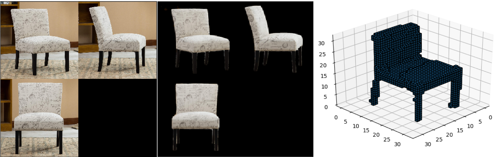

# 3D Object Reconstruction
This is an open source package to generate 3D voxels of object from 2D images. You can find a demo utilzing Streamlit app [here][0].
The implementation is based on the [3D-R2N2][1] model with integration of the [SE block][2]. This package also leverages an image segmentation tool ([DeepLab][4]) to apply the 3D reconstruction to real images. Since the official source code is implemented in Theano, the Tensorflow implementation in [this github repo][3] is used for this project. 
<!--
## Demo
This project result can be viewed in [here][0]. Note that this demo is running on CPU (m4.xlarge in AWS). 
-->
## Installation / Setup
Clone this repository to a machine with a GPU.
```
git clone https://github.com/iseong83/3d_object_reconstruction.git
cd 3d_object_reconstruction
```
Create a virtual environment and install packages
```
conda create -n 3d_reco python=3.6 # create a virtual environment
source activate 3d_reco            # start the virual environment
python setup.py install            # install this package and requirements
```

## Run Inference and Demo Locally
To run the inference/demo with the trained weights, following command will download and save the model in the `models` directory. Note that the weights are only trained ShapeNet chair category and the `freezed_model` directory will be in the `models` directory.
```
python scripts/download_model.py
```

To run the inference of the 3D object reconstruction on ShapeNet data
```
python tests/inference_3d.py
```
To run the inference on real images
```
python demo.py
```

## Train the model
### Setup directories and Download data
To setup directories (e.g. data), download ShapeNet data (`chair only`), and preprocess data; run
```
python scripts/setup_and_preprocess.py
```
Note that the traning parameters are stored in `configs/params.json`, which includes a setting of the number of data instance to preprocess (`DATASET_SIZE`).   
To start the training, run
```
python run.py
```

[0]: http://34.210.191.147:8501/
[1]: https://arxiv.org/abs/1604.00449
[2]: https://arxiv.org/abs/1709.01507
[3]: https://github.com/micmelesse/3D-reconstruction-with-Neural-Networks.git
[4]: https://arxiv.org/abs/1802.02611